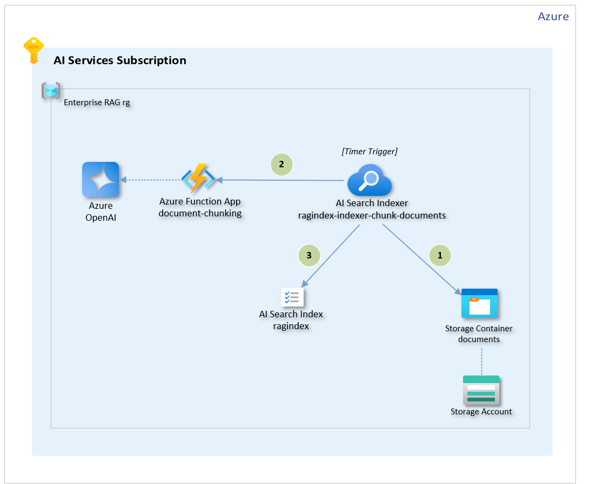
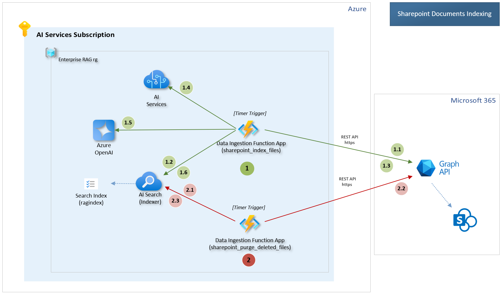

# GPT-RAG - Data Ingestion Component

Part of [GPT-RAG](https://github.com/Azure/gpt-rag)

## Table of Contents

1. [**GPT-RAG - Data Ingestion Component**](#gpt-rag---data-ingestion-component)
   - [1.1 Document Ingestion Process](#document-ingestion-process)
   - [1.2 Document Chunking Process](#document-chunking-process)
   - [1.3 Multimodal Ingestion](#multimodal-ingestion)
   - [1.4 NL2SQL and Fabric Data Ingestion](docs/NL2SQL.md)
   - [1.5 Sharepoint Indexing](#sharepoint-indexing)   
2. [**How-to: Developer**](#how-to-developer)
   - [2.1 Deploying the Ingestion Component](#deploying-the-ingestion-component)
   - [2.2 Running Locally](#running-locally)
   - [2.3 Configuring Sharepoint Connector](#configuring-sharepoint-connector)      
3. [**How-to: User**](#how-to-user)
   - [3.1 Uploading Documents for Ingestion](#uploading-documents-for-ingestion)
   - [3.2 Reindexing Documents in AI Search](#reindexing-documents-in-ai-search)
4. [**Reference**](#reference)
   - [4.1 Supported Formats and Chunkers](#supported-formats-and-chunkers)
   - [4.2 Environment Variables](#environment-variables)
   - [4.3 External Resources](#external-resources)

## Concepts

### Document Ingestion Process

The diagram below provides an overview of the document ingestion pipeline, which handles various document types, preparing them for indexing and retrieval.

  
*Document Ingestion Pipeline*

#### **Workflow**

1) The `ragindex-indexer-chunk-documents` indexer reads new documents from the `documents` blob container.

2) For each document, it calls the `document-chunking` function app to segment the content into chunks and generate embeddings using the ADA model.

3) Finally, each chunk is indexed in the AI Search Index.

### Document Chunking Process

The `document_chunking` function breaks documents into smaller segments called chunks.

When a document is submitted, the system identifies its file type and selects the appropriate chunker to divide it into chunks suitable for that specific type.

- **For `.pdf` files**, the system uses the [DocAnalysisChunker](chunking/chunkers/doc_analysis_chunker.py) with the Document Intelligence API, which extracts structured elements, like tables and sections, converting them into Markdown. LangChain splitters then segment the content based on sections. When Document Intelligence API 4.0 is enabled, `.docx` and `.pptx` files are processed with this chunker as well.

- **For image files** such as `.bmp`, `.png`, `.jpeg`, and `.tiff`, the [DocAnalysisChunker](chunking/chunkers/doc_analysis_chunker.py) performs Optical Character Recognition (OCR) to extract text before chunking.

- **For specialized formats**, specific chunkers are applied:
    - `.vtt` files (video transcriptions) are handled by the [TranscriptionChunker](chunking/chunkers/transcription_chunker.py), chunking content by time codes.
    - `.xlsx` files (spreadsheets) are processed by the [SpreadsheetChunker](chunking/chunkers/spreadsheet_chunker.py), chunking by rows or sheets.

- **For text-based files** like `.txt`, `.md`, `.json`, and `.csv`, the [LangChainChunker](chunking/chunkers/langchain_chunker.py) uses LangChain splitters to divide the content by paragraphs or sections.

This setup ensures each document is processed by the most suitable chunker, leading to efficient and accurate chunking.

> **Important:** The file extension determines the choice of chunker as outlined above.

**Customization**

The chunking process is customizable. You can modify existing chunkers or create new ones to meet specific data processing needs, optimizing the pipeline.

### Multimodal Ingestion

This repository supports image ingestion for a multimodal RAG scenario. For an overview of how multimodality is implemented in GPT-RAG, see [Multimodal RAG Overview](https://github.com/Azure/GPT-RAG/blob/main/docs/MULTIMODAL_RAG.md).

To enable multimodal ingestion, set the `MULTIMODAL` environment variable to `true` before starting to index your data.

When `MULTIMODAL` is set to `true`, the data ingestion pipeline extends its capabilities to handle both text and images within your source documents, using the `MultimodalChunker`. Below is an overview of how this **multimodal ingestion process** works, including image extraction, captioning, and cleanup.

1. **Thresholded Image Extraction**  
   - The system uses **Document Intelligence** to parse each document, detecting text elements as well as embedded images. This approach **extends** the standard `DocAnalysisChunker` by adding **image extraction** steps on top of the usual text-based process.
   - To avoid clutter and maintain relevance, an **area threshold** is applied so that only images exceeding a certain percentage of the page size are ingested. This ensures very small or irrelevant images are skipped.  
   - Any images meeting or exceeding this threshold are then extracted for further processing.

2. **Image Storage in Blob Container**  
   - Detected images are **downloaded** and placed in a dedicated Blob Storage container (by default `documents-images`).  
   - Each image is assigned a blob name and a URL, enabling the ingestion pipeline (and later queries) to reference where the image is stored.

3. **Textual Content and Captions**  
   - Alongside normal text chunking (paragraphs, sections, etc.), each extracted image is **captioned** to generate a concise textual description of its contents.  
   - These captions are combined with the surrounding text, allowing chunks to contain both **plain text** and **image references** (with descriptive captions).

4. **Unified Embeddings and Indexing**  
   - The ingestion pipeline produces **embeddings** for both text chunks and the generated image captions, storing them in the AI Search Index.  
   - The index is adapted to include fields for `contentVector` (text embeddings) and `captionVector` (image caption embeddings), as well as references to any related images in the `documents-images` container.  
   - This architecture allows **multimodal retrieval**, where queries can match either the main text or the descriptive captions.

5. **Image Cleanup Routine**  
   - A dedicated **purging process** periodically checks the `documents-images` container and removes any images **no longer referenced** in the AI Search Index.  
   - This ensures storage is kept in sync with ingested content, avoiding orphaned or stale images that are no longer needed.

By activating `MULTIMODAL`, your ingestion process captures both text and visuals in a single workflow, providing a richer knowledge base for Retrieval Augmented Generation scenarios. Queries can match not just textual content but also relevant image captions, retrieving valuable visual context stored in `documents-images`.

### Sharepoint Indexing

The SharePoint connector operates through two primary processes, each running in a separate function within the Data Ingestion Function App:

1. **Indexing SharePoint Files**: `sharepoint_index_files` function retrieves files from SharePoint, processes them, and indexes their content into the Azure AI Search Index (`ragindex`).
2. **Purging Deleted Files**: `sharepoint_purge_deleted_files` identifies and removes files that have been deleted from SharePoint to keep the search index up-to-date.

Both processes are managed by scheduled Azure Functions that run at regular intervals, leveraging configuration settings to determine their behavior. The diagram below illustrates the Sharepoint indexing.

  
*Sharepoint Indexing Workflow*

#### **Workflow**

##### 1. **Indexing Process** (sharepoint_index_files)

1.1. List files from a specific SharePoint site, directory, and file types configured in the settings.  
1.2.  Check if the document exists in the AI Search Index. If it exists, compare the `metadata_storage_last_modified` field to determine if the file has been updated.  
1.3. Use the Microsoft Graph API to download the file if it is new or has been updated.  
1.4. Process the file content using the regular document chunking process. For specific formats, like PDFs, use Document Intelligence.  
1.5. Use Azure OpenAI to generate embeddings for the document chunks.  
1.6. Upload the processed document chunks, metadata, and embeddings into the Azure AI Search Index.  

##### 2. **Purging Deleted Files** (sharepoint_purge_deleted_files)

2.1. Connect to the Azure AI Search Index to identify indexed documents.  
2.2. Query the Microsoft Graph API to verify the existence of corresponding files in SharePoint.  
2.3. Remove entries in the Azure AI Search Index for files that no longer exist.  

Azure Function triggers automate the indexing and purging processes. Indexing runs at regular intervals to ingest updated SharePoint files, while purging removes deleted files to maintain an accurate search index. By default, both processes run every 10 minutes when enabled.

If you'd like to learn how to set up the SharePoint connector, check out [SharePoint Connector Setup](https://github.com/Azure/GPT-RAG/blob/main/docs/INGESTION_SHAREPOINT_SETUP.md).


## How-to: Developer

### Deploying the Ingestion Component
- Provision the infrastructure and deploy the solution using the [GPT-RAG](https://aka.ms/gpt-rag) template.

- **Redeployment Steps**:
  - Prerequisites: 
    - **Azure Developer CLI**
    - **PowerShell** (Windows only)
    - **Git**
    - **Python 3.11**
  - Redeployment commands:
    ```bash
    azd auth login  
    azd env refresh  
    azd deploy  
    ```
    > **Note:** Use the same environment name, subscription, and region as the initial deployment when running `azd env refresh`.

### Running Locally
- Instructions for testing the data ingestion component locally using in VS Code. See [Local Deployment Guide](docs/LOCAL_DEPLOYMENT.md).

### Configuring Sharepoint Connector

Follow the instructions to configure the SharePoint Connector in the [Configuration Guide: SharePoint Connector](docs/HOW_TO_SETUP_SHAREPOINT_CONNECTOR.md).

## How-to: User

### Uploading Documents for Ingestion
- Refer to the [GPT-RAG Admin & User Guide](https://github.com/Azure/GPT-RAG/blob/main/docs/GUIDE.md#uploading-documents-for-ingestion) for instructions.

### Reindexing Documents in AI Search
- See [GPT-RAG Admin & User Guide](https://github.com/Azure/GPT-RAG/blob/main/docs/GUIDE.md#reindexing-documents-in-ai-search) for reindexing instructions.

## Reference

### Supported Formats and Chunkers
Here are the formats supported by each chunker. The file extension determines which chunker is used.

#### Doc Analysis Chunker (Document Intelligence based)
| Extension | Doc Int API Version |
|-----------|---------------------|
| pdf       | 3.1, 4.0            |
| bmp       | 3.1, 4.0            |
| jpeg      | 3.1, 4.0            |
| png       | 3.1, 4.0            |
| tiff      | 3.1, 4.0            |
| xlsx      | 4.0                 |
| docx      | 4.0                 |
| pptx      | 4.0                 |

#### LangChain Chunker  
| Extension | Format                        | LangChain Splitter |
|-----------|-------------------------------|--------------------|
| md        | Markdown document             | `MarkdownTextSplitter` |
| txt       | Plain text file               | `RecursiveCharacterTextSplitter` |
| html      | HTML document                 | `RecursiveCharacterTextSplitter` |
| shtml     | Server-side HTML document     | `RecursiveCharacterTextSplitter` |
| htm       | HTML document                 | `RecursiveCharacterTextSplitter` |
| py        | Python script                 | `PythonCodeTextSplitter` |
| csv       | Comma-separated values file   | `RecursiveCharacterTextSplitter` |
| xml       | XML data file                 | `RecursiveCharacterTextSplitter` |

#### JSON Chunker
| Extension | Format              |
|-----------|---------------------|
| json      | JSON data file      |

#### Transcription Chunker
| Extension | Format              |
|-----------|---------------------|
| vtt       | Video transcription |

#### Spreadsheet Chunker
| Extension | Format      |
|-----------|-------------|
| xlsx      | Spreadsheet |

### Environment Variables

To successfully run the orchestrator Function App, you must configure the following environment variables. These variables should be defined locally using the `.env` file (following the structure from `.env.template`) and in cloud environments, such as Azure Function App, via the `app_settings.json` file in the Application Settings section.

#### App Environment Variables

| **Variable**                             | **Value/Example**                                                                                                                                                                  | **Description**                                                                                                                       |
|------------------------------------------|------------------------------------------------------------------------------------------------------------------------------------------------------------------------------------|---------------------------------------------------------------------------------------------------------------------------------------|
| **APPLICATIONINSIGHTS_CONNECTION_STRING**    | `your-app-insights-connection string`                                                                                                                                              | This connection string provides the unique credentials and endpoints required for Application Insights telemetry.                    |
| **AZURE_AOAI_RG**                            | `rg-reuse`                                                                                                                                                                         | Specifies the resource group where your Azure OpenAI services are deployed.                                                           |
| **AZURE_EMBEDDINGS_VECTOR_SIZE**             | `3072`                                                                                                                                                                             | Sets the dimensionality for each embedding vector generated by the model.                                                             |
| **AZURE_FORMREC_SERVICE**                    | `ai0-randomvalue`                                                                                                                                                                  | Identifies the service name for your document analysis (e.g., Form Recognizer).                                                       |
| **AZURE_KEY_VAULT_ENDPOINT**                 | `https://kv0-randomvalue.vault.azure.net/`                                                                                                                                           | The endpoint URL for your Azure Key Vault where secrets are stored.                                                                   |
| **AZURE_KEY_VAULT_NAME**                     | `kv0-randomvalue`                                                                                                                                                                  | The name of your Azure Key Vault instance.                                                                                           |
| **AZURE_OPENAI_API_VERSION**                 | `2024-10-21`                                                                                                                                                                       | Specifies the API version for requests to Azure OpenAI.                                                                               |
| **AZURE_OPENAI_CHATGPT_DEPLOYMENT**          | `chat`                                                                                                                                                                             | The deployment name for the ChatGPT model within your Azure OpenAI service.                                                           |
| **AZURE_OPENAI_EMBEDDING_DEPLOYMENT**        | `text-embedding`                                                                                                                                                                   | Indicates the deployment name for the text embedding model.                                                                           |
| **AZURE_OPENAI_EMBEDDING_MODEL**             | `text-embedding-3-large`                                                                                                                                                           | The model name for generating text embeddings.                                                                                       |
| **AZURE_OPENAI_SERVICE_NAME**                | `your-aoai-resource-name`                                                                                                                                                          | The name of your Azure OpenAI service instance that hosts the deployed models.                                                        |
| **AZURE_SEARCH_APPROACH**                    | `hybrid`                                                                                                                                                                           | Defines the search strategy used by Azure Search (combining keyword and semantic search).                                               |
| **AZURE_SEARCH_INDEX_NAME**                  | `ragindex`                                                                                                                                                                         | The name of the primary Azure Search index where document chunks are stored.                                                          |
| **AZURE_SEARCH_SERVICE**                     | `your-ai-search-name`                                                                                                                                                              | The name of your Azure Search service instance.                                                                                       |
| **AZURE_STORAGE_ACCOUNT_RG**                 | `your-storage-acc-resource-group`                                                                                                                                                  | Specifies the resource group that contains your Azure Storage account for document and image storage.                                   |
| **DOCINT_API_VERSION**                       | `2024-11-30`                                                                                                                                                                       | Specifies the API version for your Document Intelligence service.                                                                     |
| **LOGLEVEL**                                 | `INFO`                                                                                                                                                                             | Sets the logging verbosity for your application (INFO level provides a balance of details and conciseness).                              |
| **MIN_CHUNK_SIZE**                           | `100`                                                                                                                                                                              | Specifies the minimum number of tokens that a document chunk must contain to be processed.                                              |
| **MULTIMODAL**                               | `true`                                                                                                                                                                             | When set to true, enables processing of both text and images during ingestion.                                                        |
| **NETWORK_ISOLATION**                        | `false`                                                                                                                                                                            | Indicates whether network isolation is enabled; typically set to false for standard deployments.                                       |
| **NUM_TOKENS**                               | `2048`                                                                                                                                                                             | Sets the maximum number of tokens allowed per document chunk.                                                                          |
| **SEARCH_ANALYZER_NAME**                     | `standard`                                                                                                                                                                         | The name of the analyzer used by Azure Search to process and index text.                                                               |
| **SEARCH_API_VERSION**                       | `2024-07-01`                                                                                                                                                                       | The API version to use for Azure Search endpoints.                                                                                     |
| **SEARCH_INDEX_INTERVAL**                    | `PT1H`                                                                                                                                                                             | The re-indexing interval (ISO 8601 duration), e.g., every 1 hour.                                                                      |
| **SEARCH_INDEX_NAME**                        | `ragindex`                                                                                                                                                                         | The primary search index name used for storing document chunks (should match the core index name).                                       |
| **STORAGE_ACCOUNT_NAME**                     | `strag0randomvalue`                                                                                                                                                                | The name of the Azure Storage account where documents and images are stored.                                                          |
| **STORAGE_CONTAINER**                        | `documents`                                                                                                                                                                        | The name of the blob container that holds your document files.                                                                         |
| **TOKEN_OVERLAP**                            | `200`                                                                                                                                                                              | The number of tokens that overlap between consecutive chunks to maintain contextual continuity.                                        |

#### Azure Function App Specific Settings

These variables must be configured directly in Function App Service as **Application Settings**, and do not need to be included in your local `.env` file. The recommended values are provided below.

| **Variable**                         | **Value/Example**      | **Description**                                                                             |
|--------------------------------------|------------------------|---------------------------------------------------------------------------------------------|
| **AzureWebJobsFeatureFlags**         | `EnableWorkerIndexing` | Enables enhanced worker indexing features within Azure Functions.                         |
| **AzureWebJobsStorage__accountName** | `strag0randomvalueing` | The account name of the Azure Storage account used by your Function App.                    |
| **AzureWebJobsStorage__credential**  | `managedidentity`      | Indicates that the Function App accesses storage using its managed identity.               |
| **BUILD_FLAGS**                      | `UseExpressBuild`      | Enables an optimized build process during deployment.                                      |
| **ENABLE_ORYX_BUILD**                | `true`                 | Enables the Oryx build system, which streamlines the build and deployment process.          |
| **FUNCTIONS_EXTENSION_VERSION**      | `~4`                   | Specifies the version of the Azure Functions runtime to use (here, version 4).                |
| **FUNCTIONS_WORKER_RUNTIME**         | `python`               | Indicates that the Function App uses the Python runtime.                                   |
| **SCM_DO_BUILD_DURING_DEPLOYMENT**   | `1`                    | Ensures that the application is built during deployment.                                  |
| **XDG_CACHE_HOME**                   | `/tmp/.cache`          | The directory path used for caching during the build and runtime phases.                     |

### External Resources
- [AI Search Enrichment Pipeline](https://learn.microsoft.com/en-us/azure/search/cognitive-search-concept-intro)
- [Azure OpenAI Embeddings Generator](https://github.com/Azure-Samples/azure-search-power-skills/tree/57214f6e8773029a638a8f56840ab79fd38574a2/Vector/EmbeddingGenerator)

