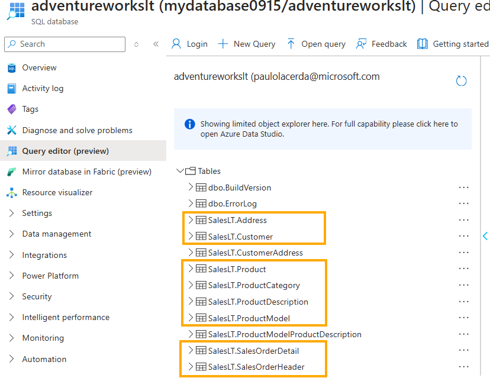
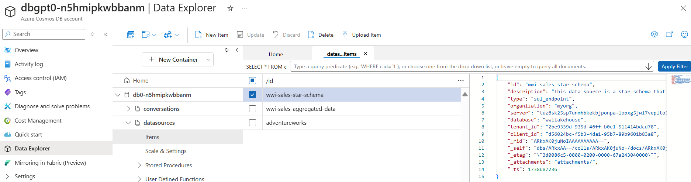

# GPT-RAG - Data Ingestion Component

Part of [GPT-RAG](https://github.com/Azure/gpt-rag)

## Table of Contents

1. [**GPT-RAG - Data Ingestion Component**](#gpt-rag---data-ingestion-component)
   - [1.1 Document Ingestion Process](#document-ingestion-process)
   - [1.2 Document Chunking Process](#document-chunking-process)
   - [1.3 Multimodal Ingestion](#multimodal-ingestion)
   - [1.4 NL2SQL and NL2DAX Data Ingestion](#nl2sql-and-nl2dax-ingestion-process)
   - [1.5 Sharepoint Indexing](#sharepoint-indexing)   
2. [**How-to: Developer**](#how-to-developer)
   - [2.1 Redeploying the Ingestion Component](#redeploying-the-ingestion-component)
   - [2.2 Running Locally](#running-locally)
   - [2.3 Configuring Sharepoint Connector](#configuring-sharepoint-connector)      
3. [**How-to: User**](#how-to-user)
   - [3.1 Uploading Documents for Ingestion](#uploading-documents-for-ingestion)
   - [3.2 Reindexing Documents in AI Search](#reindexing-documents-in-ai-search)
4. [**Reference**](#reference)
   - [4.1 Supported Formats and Chunkers](#supported-formats-and-chunkers)
   - [4.2 External Resources](#external-resources)

## Concepts

### Document Ingestion Process

The diagram below provides an overview of the document ingestion pipeline, which handles various document types, preparing them for indexing and retrieval.

  
*Document Ingestion Pipeline*

**Workflow**

1) The `ragindex-indexer-chunk-documents` indexer reads new documents from the `documents` blob container.

2) For each document, it calls the `document-chunking` function app to segment the content into chunks and generate embeddings using the ADA model.

3) Finally, each chunk is indexed in the AI Search Index.

### Document Chunking Process

The `document_chunking` function breaks documents into smaller segments called chunks.

When a document is submitted, the system identifies its file type and selects the appropriate chunker to divide it into chunks suitable for that specific type.

- **For `.pdf` files**, the system uses the [DocAnalysisChunker](chunking/chunkers/doc_analysis_chunker.py) with the Document Intelligence API, which extracts structured elements, like tables and sections, converting them into Markdown. LangChain splitters then segment the content based on sections. When Document Intelligence API 4.0 is enabled, `.docx` and `.pptx` files are processed with this chunker as well.

- **For image files** such as `.bmp`, `.png`, `.jpeg`, and `.tiff`, the [DocAnalysisChunker](chunking/chunkers/doc_analysis_chunker.py) performs Optical Character Recognition (OCR) to extract text before chunking.

- **For specialized formats**, specific chunkers are applied:
    - `.vtt` files (video transcriptions) are handled by the [TranscriptionChunker](chunking/chunkers/transcription_chunker.py), chunking content by time codes.
    - `.xlsx` files (spreadsheets) are processed by the [SpreadsheetChunker](chunking/chunkers/spreadsheet_chunker.py), chunking by rows or sheets.

- **For text-based files** like `.txt`, `.md`, `.json`, and `.csv`, the [LangChainChunker](chunking/chunkers/langchain_chunker.py) uses LangChain splitters to divide the content by paragraphs or sections.

This setup ensures each document is processed by the most suitable chunker, leading to efficient and accurate chunking.

> **Important:** The file extension determines the choice of chunker as outlined above.

**Customization**

The chunking process is customizable. You can modify existing chunkers or create new ones to meet specific data processing needs, optimizing the pipeline.

### Multimodal Ingestion

This repository supports image ingestion for a multimodal RAG scenario. For an overview of how multimodality is implemented in GPT-RAG, see [Multimodal RAG Overview](https://github.com/Azure/GPT-RAG/blob/main/docs/MULTIMODAL_RAG.md).

To enable multimodal ingestion, set the `MULTIMODAL` environment variable to `true` before starting to index your data.

When `MULTIMODAL` is set to `true`, the data ingestion pipeline extends its capabilities to handle both text and images within your source documents, using the `MultimodalChunker`. Below is an overview of how this **multimodal ingestion process** works, including image extraction, captioning, and cleanup.

1. **Thresholded Image Extraction**  
   - The system uses **Document Intelligence** to parse each document, detecting text elements as well as embedded images. This approach **extends** the standard `DocAnalysisChunker` by adding **image extraction** steps on top of the usual text-based process.
   - To avoid clutter and maintain relevance, an **area threshold** is applied so that only images exceeding a certain percentage of the page size are ingested. This ensures very small or irrelevant images are skipped.  
   - Any images meeting or exceeding this threshold are then extracted for further processing.

2. **Image Storage in Blob Container**  
   - Detected images are **downloaded** and placed in a dedicated Blob Storage container (by default `documents-images`).  
   - Each image is assigned a blob name and a URL, enabling the ingestion pipeline (and later queries) to reference where the image is stored.

3. **Textual Content and Captions**  
   - Alongside normal text chunking (paragraphs, sections, etc.), each extracted image is **captioned** to generate a concise textual description of its contents.  
   - These captions are combined with the surrounding text, allowing chunks to contain both **plain text** and **image references** (with descriptive captions).

4. **Unified Embeddings and Indexing**  
   - The ingestion pipeline produces **embeddings** for both text chunks and the generated image captions, storing them in the AI Search Index.  
   - The index is adapted to include fields for `contentVector` (text embeddings) and `captionVector` (image caption embeddings), as well as references to any related images in the `documents-images` container.  
   - This architecture allows **multimodal retrieval**, where queries can match either the main text or the descriptive captions.

5. **Image Cleanup Routine**  
   - A dedicated **purging process** periodically checks the `documents-images` container and removes any images **no longer referenced** in the AI Search Index.  
   - This ensures storage is kept in sync with ingested content, avoiding orphaned or stale images that are no longer needed.

By activating `MULTIMODAL`, your ingestion process captures both text and visuals in a single workflow, providing a richer knowledge base for Retrieval Augmented Generation scenarios. Queries can match not just textual content but also relevant image captions, retrieving valuable visual context stored in `documents-images`.

### NL2SQL and NL2DAX Ingestion Process

If you are using NL2SQL or Chat with Fabric Data strategies in your orchestration component, you need to index some metadata. Additionally, you can index sample query content to assist with retrieval during query generation. This indexed content helps generate SQL and DAX queries more effectively using these strategies. More details about agentic strategies can be found in the [orchestrator repository](https://github.com/azure/gpt-rag-agentic).


The ingestion process indexes three types of content:

- **query**: Sample queries used for few-shot learning by the orchestrator (optional).
- **table**: Descriptions of tables and their columns, serving as a data dictionary.
- **measure**: Definitions of measures, including name, description, data type, and source information, to help the orchestrator select appropriate measures for calculations.

Each item—query, table, or measure—is represented as a JSON file with specific attributes. JSON files should be stored in the `queries`, `tables`, and `measures` folders inside the `nl2sql` container in the solution's storage account.

The diagram below illustrates the NL2SQL data ingestion pipeline:

  
*NL2SQL Ingestion Pipeline*

### Tables

Here’s an example of a table metadata file:

```json
{
    "table": "dimension_city",
    "description": "City dimension table containing details of locations associated with sales and customers.",
    "datasource": "wwi-sales-star-schema",
    "columns": [
        {
            "name": "CityKey",
            "description": "Primary key for city records."
        },
        {
            "name": "WWICityID",
            "description": "Identifier for the city in the worldwide database."
        },
        {
            "name": "City",
            "description": "Name of the city."
        },
        {
            "name": "StateProvince",
            "description": "State or province where the city is located."
        },
        {
            "name": "Country",
            "description": "Country where the city is located."
        }
    ]
}
```

### Queries

Here’s an example of an SQL query file:

```json
{
   "datasource": "adventureworks",
   "question": "What are the top 5 most expensive products currently available for sale?",
    "query": "SELECT TOP 5 ProductID, Name, ListPrice FROM SalesLT.Product WHERE SellEndDate IS NULL ORDER BY ListPrice DESC",
    "reasoning": "This query retrieves the top 5 products with the highest selling prices that are currently available for sale. It uses the SalesLT.Product table, selects relevant columns, and filters out products that are no longer available by checking that SellEndDate is NULL."
}
```

Here’s an example of a DAX query:

```json
{
    "datasource": "wwi-sales-aggregated-data",
    "question": "Who are the top 5 employees with the highest total sales including tax?",
    "query": "EVALUATE TOPN(5, SUMMARIZE(aggregate_sale_by_date_employee, aggregate_sale_by_date_employee[Employee], aggregate_sale_by_date_employee[SumOfTotalIncludingTax]), aggregate_sale_by_date_employee[SumOfTotalIncludingTax], DESC)",
    "reasoning": "This DAX query identifies the top 5 employees based on the total sales amount including tax. It leverages the aggregate_sale_by_date_employee table, aggregates the sales data by employee, and orders the results to display the highest earners first."
}
```

#### Measures

When indexing measures, the input JSON should have the following attributes:

- **name:** The name of the measure.
- **description:** A brief description of the measure.
- **datasource:** The datasource where the measure resides.
- **type:** The type of the measure ("external" or "local").
- **source_table:** The source table associated with the local measure.
- **data_type:** The data type of the measure.
- **source_model:** The source model for the measure.

**Example of an External Measure JSON:**
```json
{
  "datasource": "Ecommerce",
  "name": "Total Revenue (%)",
  "description": "Calculates the percentage of total revenue for the selected period.",
  "type": "external",
  "source_table": "",
  "data_type": "CURRENCY",
  "source_model": "Executive Sales Dashboard"
}
```

Additional examples of queries and tables can be found in the [**samples**](samples) directory of this repository.

SQL Database examples are based on the [Adventure Works sample SQL Database](https://learn.microsoft.com/en-us/sql/samples/adventureworks-install-configure?view=sql-server-ver16&tabs=ssms#deploy-to-azure-sql-database), which you can install in an Azure SQL Database.

  
*Sample Adventure Works Database Tables*

Fabric-based examples use the fictional Wide World Importers company Lakehouse and a semantic model generated using this [tutorial](https://learn.microsoft.com/en-us/fabric/data-engineering/tutorial-lakehouse-introduction).

### Datasources

Every JSON file, whether describing a query or a table, contains a **datasource** field. This field represents the **datasource ID**, which is an internal identifier used by GPT-RAG to manage multiple data sources.

The datasource information is stored as a JSON document in the `datasources` container within CosmosDB, used by GPT-RAG. This document contains relevant details about the specific datasource, including its type and connection details.

  
*Example of Datasources in CosmosDB*

Currently, there are three types of datasources:

1. **Semantic Model**  
2. **SQL Endpoint**  
3. **SQL Database**  

The first two are designed for Fabric, where the orchestrator connects to the datasource using a Service Principal/App Registration. For SQL Database connections, Managed Identity is used. Instructions on configuring connections for Fabric and SQL Database can be found in the **administration guide** in the main GPT-RAG repository.

Below are examples of different types of datasource configurations:

#### **Semantic Model Datasource**
```json
{
    "id": "wwi-sales-aggregated-data",    
    "description": "This data source is a semantic model containing aggregated sales data. It is ideal for insights such as sales by employee or city.",
    "type": "semantic_model",
    "organization": "myorg",
    "dataset": "your_dataset_or_semantic_model_name",
    "tenant_id": "your_sp_tenant_id",
    "client_id": "your_sp_client_id"    
}
```

#### **SQL Endpoint Datasource**
```json
{
    "id": "wwi-sales-star-schema",
    "description": "This data source is a star schema that organizes sales data. It includes a fact table for sales and dimension tables such as city, customer, and inventory items (products).",
    "type": "sql_endpoint",
    "organization": "myorg",
    "server": "your_sql_endpoint. Ex: xpto.datawarehouse.fabric.microsoft.com",
    "database": "your_lakehouse_name",
    "tenant_id": "your_sp_tenant_id",
    "client_id": "your_sp_client_id"
}
```

#### **SQL Database Datasource**
```json
{
    "id": "adventureworks",
    "description": "AdventureWorksLT is a database featuring a schema with tables for customers, orders, products, and sales.",
    "type": "sql_database",
    "database": "adventureworkslt",
    "server": "sqlservername.database.windows.net"
}
```

**Workflow**

This outlines the ingestion workflow for **query** elements.

> **Note:**  
> The workflow for tables and columns is similar; just replace **queries** with **tables** or **columns** in the steps below.

1. The AI Search `queries-indexer` scans for new query files (each containing a single query) within the `queries` folder in the `nl2sql` storage container.

   > **Note:**  
   > Files are stored in the `queries` folder, not in the root of the `nl2sql` container. This setup also applies to `tables` and `columns`.

2. The `queries-indexer` then uses the `#Microsoft.Skills.Text.AzureOpenAIEmbeddingSkill` to create a vectorized representation of the question text using the Azure OpenAI Embeddings model.

   > **Note:**  
   > For query items, the question itself is vectorized. For tables and columns, their descriptions are vectorized.

3. Finally, the indexed content is added to the `nl2sql-queries` index.

### Sharepoint Indexing

The SharePoint connector operates through two primary processes, each running in a separate function within the Data Ingestion Function App:

1. **Indexing SharePoint Files**: `sharepoint_index_files` function retrieves files from SharePoint, processes them, and indexes their content into the Azure AI Search Index (`ragindex`).
2. **Purging Deleted Files**: `sharepoint_purge_deleted_files` identifies and removes files that have been deleted from SharePoint to keep the search index up-to-date.

Both processes are managed by scheduled Azure Functions that run at regular intervals, leveraging configuration settings to determine their behavior. The diagram below illustrates the Sharepoint indexing.

  
*Sharepoint Indexing Workflow*

**Workflow**

### 1. **Indexing Process** (sharepoint_index_files)

1.1. List files from a specific SharePoint site, directory, and file types configured in the settings.  
1.2.  Check if the document exists in the AI Search Index. If it exists, compare the `metadata_storage_last_modified` field to determine if the file has been updated.  
1.3. Use the Microsoft Graph API to download the file if it is new or has been updated.  
1.4. Process the file content using the regular document chunking process. For specific formats, like PDFs, use Document Intelligence.  
1.5. Use Azure OpenAI to generate embeddings for the document chunks.  
1.6. Upload the processed document chunks, metadata, and embeddings into the Azure AI Search Index.  

### 2. **Purging Deleted Files** (sharepoint_purge_deleted_files)

2.1. Connect to the Azure AI Search Index to identify indexed documents.  
2.2. Query the Microsoft Graph API to verify the existence of corresponding files in SharePoint.  
2.3. Remove entries in the Azure AI Search Index for files that no longer exist.  

Azure Function triggers automate the indexing and purging processes. Indexing runs at regular intervals to ingest updated SharePoint files, while purging removes deleted files to maintain an accurate search index. By default, both processes run every 10 minutes when enabled.

If you'd like to learn how to set up the SharePoint connector, check out [SharePoint Connector Setup](https://github.com/Azure/GPT-RAG/blob/main/docs/INGESTION_SHAREPOINT_SETUP.md).


## How-to: Developer

### Redeploying the Ingestion Component
- Provision the infrastructure and deploy the solution using the [GPT-RAG](https://aka.ms/gpt-rag) template.

- **Redeployment Steps**:
  - Prerequisites: 
    - **Azure Developer CLI**
    - **PowerShell** (Windows only)
    - **Git**
    - **Python 3.11**
  - Redeployment commands:
    ```bash
    azd auth login  
    azd env refresh  
    azd deploy  
    ```
    > **Note:** Use the same environment name, subscription, and region as the initial deployment when running `azd env refresh`.

### Running Locally
- Instructions for testing the data ingestion component locally using in VS Code. See [Local Deployment Guide](docs/LOCAL_DEPLOYMENT.md).

### Configuring Sharepoint Connector

Follow the instructions to configure the SharePoint Connector in the [Configuration Guide: SharePoint Connector](docs/HOW_TO_SETUP_SHAREPOINT_CONNECTOR.md).

## How-to: User

### Uploading Documents for Ingestion
- Refer to the [GPT-RAG Admin & User Guide](https://github.com/Azure/GPT-RAG/blob/main/docs/GUIDE.md#uploading-documents-for-ingestion) for instructions.

### Reindexing Documents in AI Search
- See [GPT-RAG Admin & User Guide](https://github.com/Azure/GPT-RAG/blob/main/docs/GUIDE.md#reindexing-documents-in-ai-search) for reindexing instructions.

## Reference

### Supported Formats and Chunkers
Here are the formats supported by each chunker. The file extension determines which chunker is used.

#### Doc Analysis Chunker (Document Intelligence based)
| Extension | Doc Int API Version |
|-----------|---------------------|
| pdf       | 3.1, 4.0            |
| bmp       | 3.1, 4.0            |
| jpeg      | 3.1, 4.0            |
| png       | 3.1, 4.0            |
| tiff      | 3.1, 4.0            |
| xlsx      | 4.0                 |
| docx      | 4.0                 |
| pptx      | 4.0                 |

#### LangChain Chunker
| Extension | Format                        |
|-----------|-------------------------------|
| md        | Markdown document             |
| txt       | Plain text file               |
| html      | HTML document                 |
| shtml     | Server-side HTML document     |
| htm       | HTML document                 |
| py        | Python script                 |
| json      | JSON data file                |
| csv       | Comma-separated values file   |
| xml       | XML data file                 |

#### Transcription Chunker
| Extension | Format              |
|-----------|---------------------|
| vtt       | Video transcription |

#### Spreadsheet Chunker
| Extension | Format      |
|-----------|-------------|
| xlsx      | Spreadsheet |

### External Resources
- [AI Search Enrichment Pipeline](https://learn.microsoft.com/en-us/azure/search/cognitive-search-concept-intro)
- [Azure OpenAI Embeddings Generator](https://github.com/Azure-Samples/azure-search-power-skills/tree/57214f6e8773029a638a8f56840ab79fd38574a2/Vector/EmbeddingGenerator)
