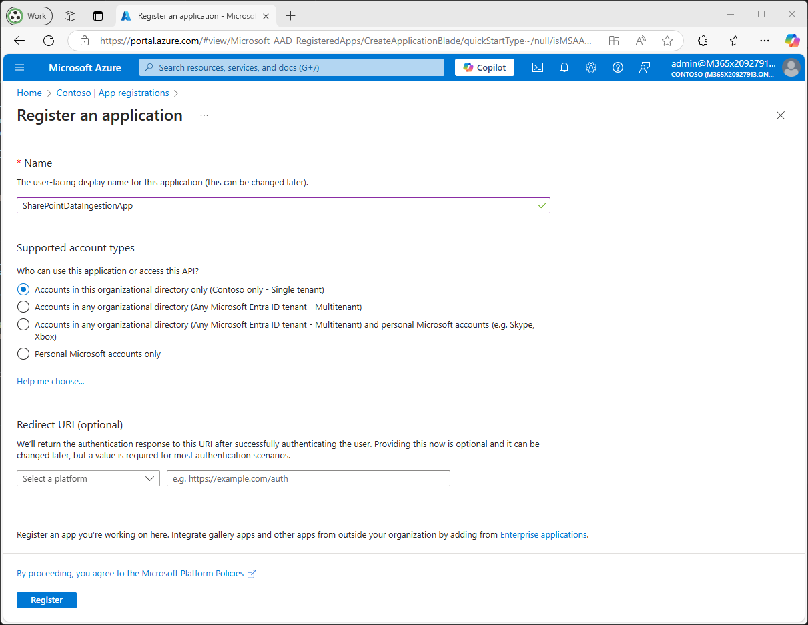
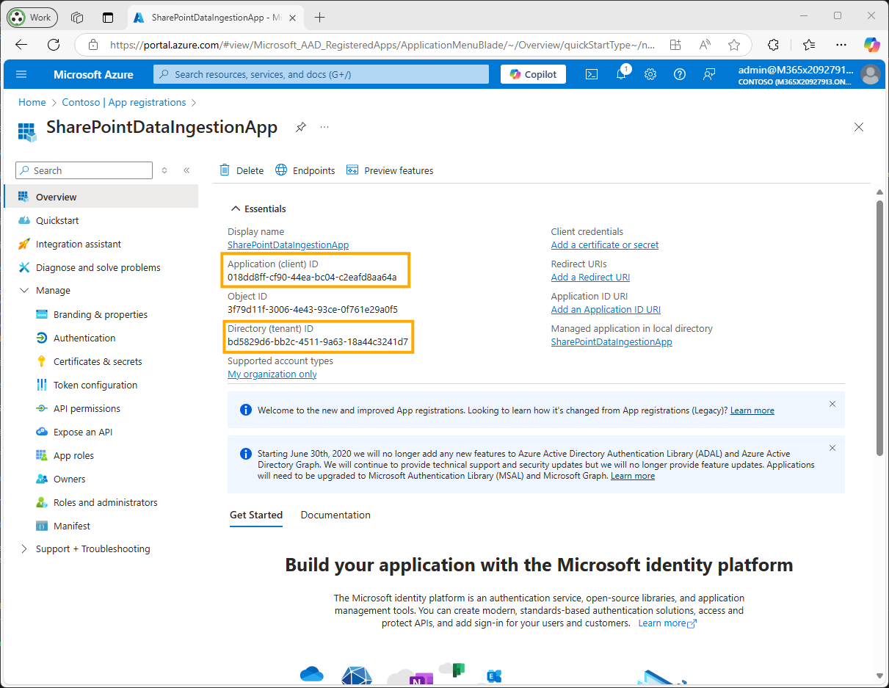
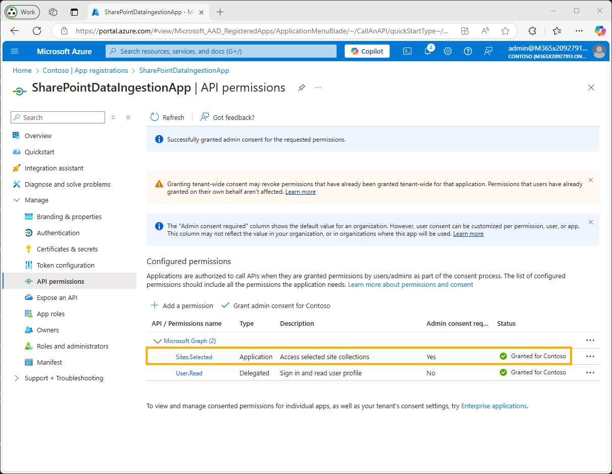
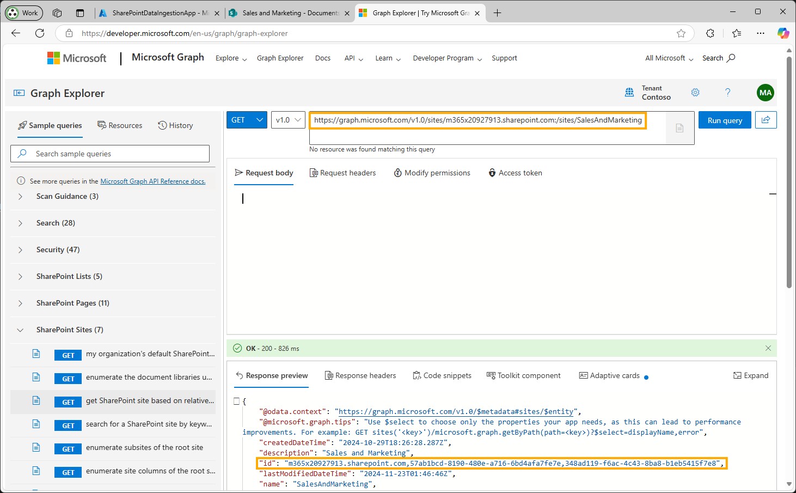
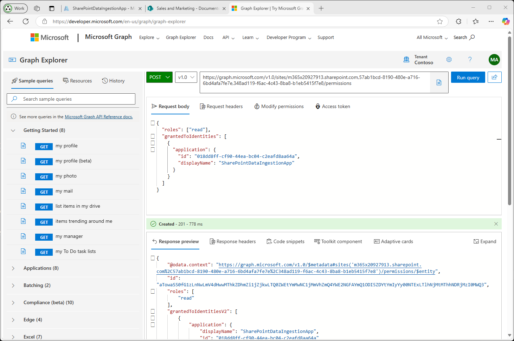
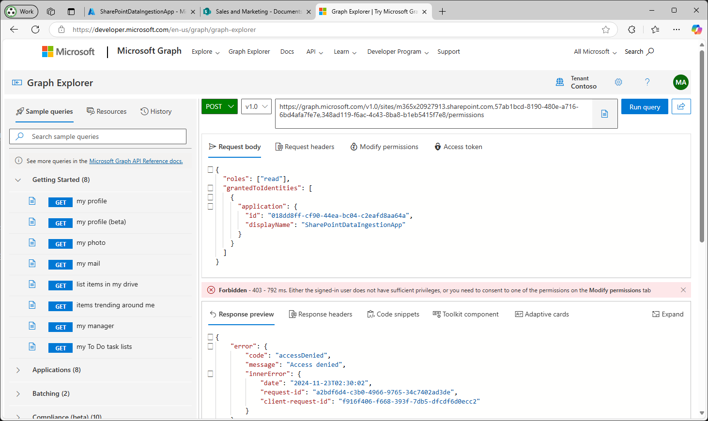
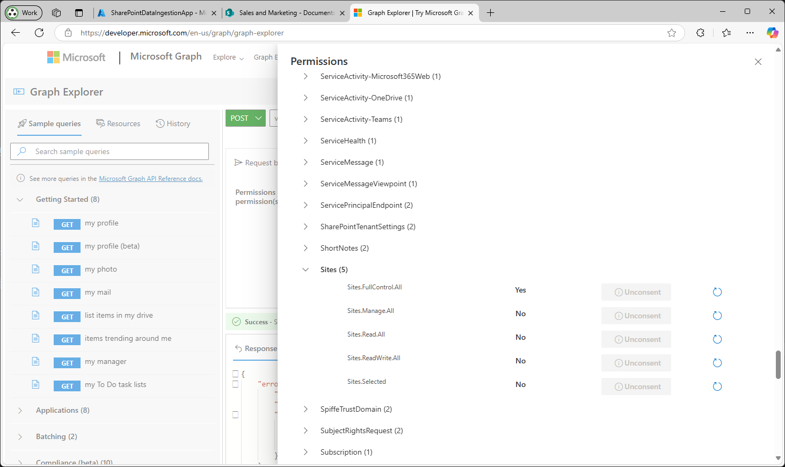
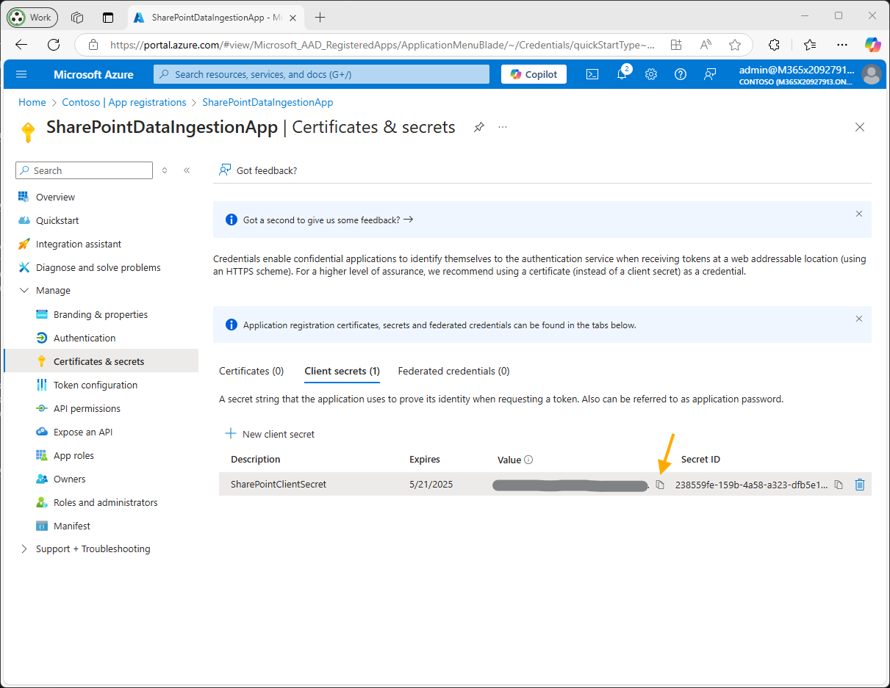

# SharePoint Setup

This section explains how to configure SharePoint as a data source for the `ragindex` GPT-RAG Azure AI Search Index, using the `Sites.Selected` permission to limit access to specific site collections.

## Prerequisites

* **Azure AD app registration permissions**: You need a role like Application Administrator, Cloud Application Administrator or Global Administrator to register an app in Azure AD. For built-in roles details, see [roles overview](https://learn.microsoft.com/en-us/azure/active-directory/roles/permissions-reference); for registration steps, see [Quickstart: register an app](https://learn.microsoft.com/en-us/azure/active-directory/develop/quickstart-register-app).
* **SharePoint access**: Ensure your account can reach the SharePoint site(s) you’ll index. If curious about permission levels, see [SharePoint permissions overview](https://learn.microsoft.com/en-us/sharepoint/permissions-overview); otherwise, simply confirm you can browse the target site.
* **Microsoft Graph API calls for selected permissions**: Granting `Sites.Selected` requires using Graph endpoints rather than only the portal UI. For background, you may refer to [Overview of selected permissions](https://learn.microsoft.com/en-us/graph/permissions-selected-overview) and, if interested, the general [Microsoft Graph overview](https://learn.microsoft.com/en-us/graph/overview). If you need to understand authentication flows, see [Microsoft identity platform: service-to-service](https://learn.microsoft.com/en-us/azure/active-directory/develop/v2-oauth2-client-creds-grant-flow).
* **Search Index Data Contributor role**: Assign your Function App identity the Search Index Data Contributor role so it can push documents into Azure Cognitive Search. If desired, see [RBAC roles for Azure Cognitive Search](https://learn.microsoft.com/en-us/azure/search/search-security-rbac) and the broader [Azure RBAC guide](https://learn.microsoft.com/en-us/azure/role-based-access-control/overview).

> [!Note]
> This page will walk you through how to configure SharePoint as a data source for indexing. You don’t need to follow the links above unless you want more details.


## Procedure

### 1. Register an Application in Azure Entra ID

* **Sign in to the Azure Portal**: Go to [Azure Portal](https://portal.azure.com/) to register a new app. 
<!-- ([Azure AD Quickstart](https://learn.microsoft.com/en-us/azure/active-directory/develop/quickstart-register-app)). -->

* **Register a New Application**: Navigate to **Azure Active Directory** > **App registrations** > **New registration**.

  * **Name**: Enter a descriptive name (e.g., `SharePointDataIngestionApp`).
  * **Supported account types**: Choose “Accounts in this organizational directory only” unless cross-tenant is needed.
   <!-- ([App registration details](https://learn.microsoft.com/en-us/azure/active-directory/develop/quickstart-register-app)). -->
  * **Redirect URI**: Leave empty for a background service.
  * Click **Register**.
* **Record Application IDs**: Save the **Application (client) ID** and **Directory (tenant) ID** for later use in authentication.
 <!-- ([Retrieve client and tenant IDs](https://learn.microsoft.com/en-us/azure/active-directory/develop/quickstart-register-app#register-an-application)). -->

  
  *Registering the application in Azure AD*

  
  *Recording the Application (client) ID and Tenant ID*

### 2. Configure API Permissions

* **Navigate to API Permissions**: In your registered app, go to **API permissions** > **Add a permission**.
* **Add Microsoft Graph Permissions**:

  * Select **Microsoft Graph** > **Application permissions**.
  * Search and add **`Sites.Selected`** ([Sites.Selected permission reference](https://learn.microsoft.com/en-us/graph/permissions-reference#sites-selected)).
* **Grant Admin Consent**: Click **Grant admin consent for \[Your Tenant Name]** and confirm. This ensures the permission is effective for app-only calls ([Grant admin consent reference](https://learn.microsoft.com/en-us/azure/active-directory/manage-apps/grant-admin-consent)).

  
  *Granting admin consent for `Sites.Selected` permission*

### 3. Assign Access to Specific SharePoint Site Collections

The `Sites.Selected` permission by itself does not grant access to any sites; you must explicitly grant access to each site collection via Graph API or PowerShell ([Sites.Selected overview](https://learn.microsoft.com/en-us/graph/permissions-selected-overview)).

#### 3.1 Gather Site Information

* **Site URL**: Note the SharePoint site URL you wish to index, e.g., `https://yourdomain.sharepoint.com/sites/YourSiteName`.
* **Site ID**: Retrieve via Microsoft Graph:

  * Use Graph Explorer or a REST client authenticated with an account that has access.
  * **GET Site by path**:

    ```http
    GET https://graph.microsoft.com/v1.0/sites/{hostname}:/{server-relative-path}
    ```

    Replace `{hostname}` with `yourdomain.sharepoint.com` and `{server-relative-path}` with `/sites/YourSiteName` ([Get site by path reference](https://learn.microsoft.com/en-us/graph/api/site-get?view=graph-rest-1.0)).
  * **Example**:

    ```http
    GET https://graph.microsoft.com/v1.0/sites/yourdomain.sharepoint.com:/sites/YourSiteName
    ```

    The JSON response includes `"id": "<site-id>"`.

    
    *Retrieving Site ID using Graph Explorer*

#### 3.2 Retrieve Drive ID of the Document Library

Once you have the Site ID, fetch the Drive ID representing the document library to index. In Graph, a “drive” corresponds to a document library in SharePoint ([Drive resource documentation](https://learn.microsoft.com/en-us/graph/api/drive-get?view=graph-rest-1.0)).

* **GET Default Document Library**:

  ```http
  GET https://graph.microsoft.com/v1.0/sites/{site-id}/drive
  ```

  This returns the default “Documents” library with its `"id"` (Drive ID) in the JSON ([Get default drive reference](https://learn.microsoft.com/en-us/graph/api/drive-get?view=graph-rest-1.0)).
* **List All Document Libraries**:

  ```http
  GET https://graph.microsoft.com/v1.0/sites/{site-id}/drives
  ```

  This returns an array of drives (libraries) under the site; each entry has `"id"` and `"name"` so you can pick the correct library ([List drives under site reference](https://learn.microsoft.com/en-us/graph/api/drive-list?view=graph-rest-1.0)).
* **Example**:

  ```http
  GET https://graph.microsoft.com/v1.0/sites/{site-id}/drives
  ```

  Response snippet:

  ```json
  {
    "value": [
      {
        "id": "b!abcd1234_efgh5678_ijkl9012_mnop3456",
        "name": "Documents",
        "driveType": "documentLibrary"
      },
      {
        "id": "b!qrst9876_uvwx5432_yzab1098_cdef7654",
        "name": "Shared Documents",
        "driveType": "documentLibrary"
      }
      // ...
    ]
  }
  ```
* **Why This Matters**: Your ingestion code uses endpoints like `/sites/{site-id}/drives/{drive-id}/root/children` to traverse files ([Graph list children reference](https://learn.microsoft.com/en-us/graph/api/driveitem-list-children?view=graph-rest-1.0)).

#### 3.3 Grant the Application Access to the Site

After obtaining Site ID (and Drive ID), grant the registered application access to the site:

* **POST to `/sites/{site-id}/permissions`**:

  ```http
  POST https://graph.microsoft.com/v1.0/sites/{site-id}/permissions
  ```

  **Request Body**:

  ```json
  {
    "roles": ["read"],
    "grantedToIdentities": [
      {
        "application": {
          "id": "<application-client-id>",
          "displayName": "SharePointDataIngestionApp"
        }
      }
    ]
  }
  ```

  Replace `<application-client-id>` with your Application (client) ID. Use `"read"` or `"write"` depending on whether you need to update indexed content.
* **Verify 201 Created**: A successful creation returns HTTP 201. Repeat for each site.
* **Error Handling**: If you get 403 Forbidden, ensure your admin account has privilege to grant the permission and that you granted admin consent for `Sites.Selected`.

  
  *Assigning site permissions via Graph Explorer*

  
  *Example permission denied when assigning permissions*

  
  *Granting consent so the application can apply permissions*

### 4. Create a Client Secret

* **Navigate to Certificates & Secrets**: In the registered app, select **Certificates & secrets** under **Manage**.
* **Add a New Client Secret**:

  * Click **New client secret**.
  * Provide a description (e.g., `SharePointClientSecret`) and choose expiration.
  * Click **Add**.
* **Record the Client Secret Value**: Copy and securely store the secret value (not the ID). You will use this in your Function App or Key Vault retrieval logic.

  
  *Creating and recording the client secret value*

### 5. Gather SharePoint Site and Drive Information

* **Site Domain**: e.g., `yourdomain.sharepoint.com`.
* **Site Name**: e.g., `YourSiteName`.
* **Site ID**: Retrieved earlier via Graph.
* **Drive ID**: Retrieved via `/sites/{site-id}/drive` or `/sites/{site-id}/drives`.
* **Subfolder Names (optional)**: Comma-separated list of folder paths under root of drive, e.g., `Shared Documents/General,Shared Documents/Reports`. Leave empty or set to `/` to index entire drive.
* **File Formats**: Comma-separated extensions to index (e.g., `pdf,docx,pptx`).

### 6. Configure Function App Environment Variables

In the Azure Portal, navigate to your Function App > **Configuration** > **Application settings**. Add:

```plaintext
# Enable the connector
SHAREPOINT_CONNECTOR_ENABLED=true

# Required authentication
SHAREPOINT_TENANT_ID=<your_tenant_id>
SHAREPOINT_CLIENT_ID=<your_client_id>
# If using Key Vault:
SHAREPOINT_CLIENT_SECRET=<your_client_secret>
SHAREPOINT_CLIENT_SECRET_NAME=sharepointClientSecret

# SharePoint site and drive
SHAREPOINT_SITE_DOMAIN=yourdomain.sharepoint.com
SHAREPOINT_SITE_NAME=YourSiteName
SHAREPOINT_DRIVE_ID=<your_drive_id>

# Optional: Subfolders to index
SHAREPOINT_SUBFOLDERS_NAMES="Shared Documents/General,Shared Documents/Reports"

# File formats to include
SHAREPOINT_FILES_FORMAT=pdf,docx,pptx

# AI Search index name
AZURE_SEARCH_SHAREPOINT_INDEX_NAME=ragindex
```

> `SHAREPOINT_SUBFOLDERS_NAMES` is a comma-separated list of folder paths relative to the root of the drive; use `/` or leave empty to index the entire drive. After saving, restart the Function App to apply changes.

### Validation

1. **Test Data Ingestion**

   * **Trigger the Ingestion Process**: Wait for the scheduled run (e.g., every 30 minutes) or invoke manually.
   * **Monitor Logs**: Confirm that files are discovered, downloaded, chunked, and indexed without errors. Use Application Insights or Function logs.
2. **Verify Indexed Data**

   * **Check Azure Cognitive Search Index**: In Azure Portal or via REST API, confirm documents from SharePoint appear.
   * **Perform Search Queries**: Execute test queries against the index to ensure content is searchable.

> Using `Sites.Selected` ensures your app only accesses explicitly granted site collections, following least-privilege security principles.

---

## Additional Information

* **Removing Permissions**:

  ```http
  DELETE https://graph.microsoft.com/v1.0/sites/{site-id}/permissions/{permission-id}
  ```

  To get `permission-id`, list permissions:

  ```http
  GET https://graph.microsoft.com/v1.0/sites/{site-id}/permissions
  ```

* **Understanding `Sites.Selected` Permission**:
  By itself, it does not grant access to any site collections; only sites explicitly granted via Graph API calls are accessible ([Permissions reference](https://learn.microsoft.com/en-us/graph/permissions-reference#sites-selected)).

* **Graph API References**:

  * **Get site by path**: `GET https://graph.microsoft.com/v1.0/sites/{hostname}:/{server-relative-path}` ([Get site](https://learn.microsoft.com/en-us/graph/api/site-get?view=graph-rest-1.0)).
  * **Get default drive**: `GET https://graph.microsoft.com/v1.0/sites/{site-id}/drive` ([Get drive](https://learn.microsoft.com/en-us/graph/api/drive-get?view=graph-rest-1.0)).
  * **List drives**: `GET https://graph.microsoft.com/v1.0/sites/{site-id}/drives` ([List drives](https://learn.microsoft.com/en-us/graph/api/drive-list?view=graph-rest-1.0)).
  * **List folder children**: `GET https://graph.microsoft.com/v1.0/sites/{site-id}/drives/{drive-id}/root/children`.

* **Example Q\&A and Community Guidance**:

  * How to find Site ID and Drive ID: [Microsoft Q\&A](https://learn.microsoft.com/en-us/answers/questions/730575/how-to-find-site-id-and-drive-id-for-graph-api) confirms using `/sites?search=` or `/sites/{site-id}/drive`.
  * Assigning `Sites.Selected` via Graph: community blogs and Microsoft Q\&A demonstrate the POST to `/sites/{site-id}/permissions` ([Graph permissions assignment example](https://techcommunity.microsoft.com/blog/spblog/develop-applications-that-use-sites-selected-permissions-for-spo-sites-/3790476)).

* **Azure AI Search RBAC**:
  Ensure the identity has at least Search Index Data Contributor role via Azure RBAC: see [Search security roles](https://learn.microsoft.com/en-us/azure/search/search-security-rbac).
