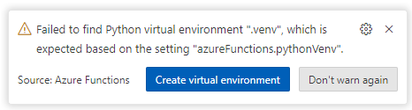
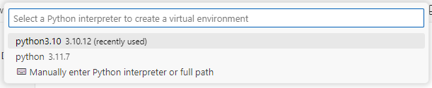

## Running locally with VS Code

You can run the **data ingestion** locally in VS Code to contribute, adjust, test, or debug.

Ensure proper provisioning of cloud resources as per instructions in the [Enterprise RAG repo](https://github.com/Azure/GPT-RAG?tab=readme-ov-file#getting-started) before local deployment of the data ingestion function.

Once the cloud resources (such as Azure OpenAI, Azure KeyVault) have been provisioned as per the instructions mentioned earlier, follow these steps:  
   
1. Clone this repository.  

2. Install [Azure Functions Core Tools](https://learn.microsoft.com/en-us/azure/azure-functions/functions-run-local?tabs=windows%2Cisolated-process%2Cnode-v4%2Cpython-v2%2Chttp-trigger%2Ccontainer-apps&pivots=programming-language-python#install-the-azure-functions-core-tools)

3. Ensure that your VS Code has the following extensions installed:  
  
   - [Azure Functions](https://marketplace.visualstudio.com/items?itemName=ms-azuretools.vscode-azurefunctions)  
   - [Azurite (blob storage emulator)](https://marketplace.visualstudio.com/items?itemName=Azurite.azurite)  
   
4. Refer to the sections [Key Vault Access Policies](#key-vault-access-policies) and [Storage Account Role](#storage-account-role) to grant the necessary roles and policies needed to run the function locally.  
   
5. Open VS Code in the directory where you cloned the repository.  
   
6. When opening it for the first time, create a virtual environment and point it to [Python version 3.10 or 3.11](https://www.python.org/downloads/release/python-31011/). <BR>Follow the examples illustrated in the images below.  




   
7. Create a copy and then rename the file `local.settings.json.template` to `local.settings.json` and update it with your environment information.  
   
8. Before running the function locally, start the Azurite storage emulator. You can do this by double-clicking [Azurite Blob Service], located in the bottom right corner of the status bar.

9. Done! Now you just need to hit F5 (Start Debugging) to run the orchestrator function at  `http://localhost:7071/api/orc`.

**Note:** you can download this [Postman Collection](../tests/gpt-rag-ingestion.postman_collection.json) to test your orchestrator endpoint.

### Roles You Have to Assign to Your User

Since we're now using managed identities, you need to assign the following roles to your user. Each role assignment can be done using the Azure CLI scripts provided below or you can assign the role via the Azure Portal.

1. **Azure OpenAI Resource 'Cognitive Services OpenAI User' Role**

    ```bash
    subscriptionId='your-subscription-id'
    resourceGroupName='your-resource-group-name'
    openAIAccountName='your-azure-openai-service-name'
    principalId='your-user-object-id-in-microsoft-entra-id'

    az role assignment create \
      --role "Cognitive Services OpenAI User" \
      --assignee $principalId \
      --scope /subscriptions/$subscriptionId/resourceGroups/$resourceGroupName/providers/Microsoft.CognitiveServices/accounts/$openAIAccountName
    ```

2. **Azure AI Search 'Search Service Contributor' and 'Search Index Data Contributor' Roles**

    ```bash
    subscriptionId='your-subscription-id'
    resourceGroupName='your-resource-group-name'
    aiSearchResource='your-ai-search-resource-name'
    principalId='your-user-object-id-in-microsoft-entra-id'

    az role assignment create \
      --role "Search Service Contributor" \
      --assignee $principalId \
      --scope /subscriptions/$subscriptionId/resourceGroups/$resourceGroupName/providers/Microsoft.Search/searchServices/$aiSearchResource

    az role assignment create \
      --role "Search Index Data Contributor" \
      --assignee $principalId \
      --scope /subscriptions/$subscriptionId/resourceGroups/$resourceGroupName/providers/Microsoft.Search/searchServices/$aiSearchResource
    ```

3. **Storage Blob Data Contributor**

    To read the content of the **blob storage**, assign the **Storage Blob Data Contributor** role to the identity used to run the program locally. 

    **Using Azure CLI:**

    ```bash
    subscriptionId='your-subscription-id'
    resourceGroupName='your-resource-group-name'
    storageAccountName='your-storage-account-name'
    principalId='your-user-object-id-in-microsoft-entra-id'

    az role assignment create \
      --role "Storage Blob Data Contributor" \
      --assignee $principalId \
      --scope /subscriptions/$subscriptionId/resourceGroups/$resourceGroupName/providers/Microsoft.Storage/storageAccounts/$storageAccountName
    ```

4. **Key Vault 'Secret Management' Roles**

    Assign the necessary permissions to manage secrets within your Key Vault.

    ```bash
    subscriptionId='your-subscription-id'
    resourceGroupName='your-resource-group-name'
    keyVaultName='your-key-vault-name'
    principalId='your-user-object-id-in-microsoft-entra-id'

    az keyvault set-policy \
      --name $keyVaultName \
      --object-id $principalId \
      --secret-permissions get list set
    ```

5. **Cognitive Services User**

    Assign the **Cognitive Services User** role to allow access to Cognitive Services resources.

    ```bash
    subscriptionId='your-subscription-id'
    resourceGroupName='your-resource-group-name'
    cognitiveServicesName='your-cognitive-services-account-name'
    principalId='your-user-object-id-in-microsoft-entra-id'

    az role assignment create \
      --role "Cognitive Services User" \
      --assignee $principalId \
      --scope /subscriptions/$subscriptionId/resourceGroups/$resourceGroupName/providers/Microsoft.CognitiveServices/accounts/$cognitiveServicesName
    ```

---

> [!Note] 
> Replace the placeholder values (e.g., `'your-subscription-id'`, `'your-resource-group-name'`, etc.) with your actual Azure resource details and your user's Object ID from Microsoft Entra ID.

By following these scripts, you ensure that your user has the necessary permissions to interact with the required Azure services when running the data ingestion locally with VS Code.