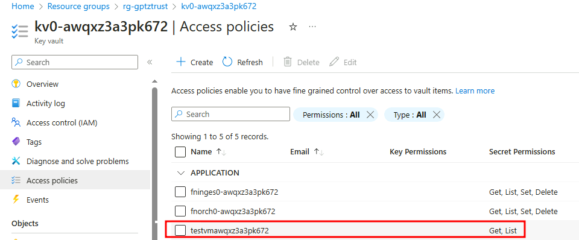
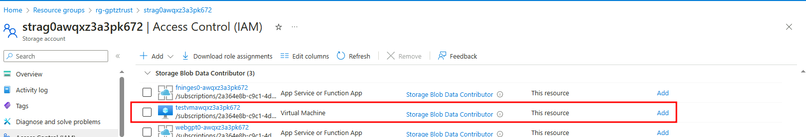

## Running locally with VS Code

You can run the **data ingestion** locally in VS Code to contribute, adjust, test, or debug.

Ensure proper provisioning of cloud resources as per instructions in the [Enterprise RAG repo](https://github.com/Azure/GPT-RAG?tab=readme-ov-file#getting-started) before local deployment of the data ingestion function.

Once the cloud resources (such as Azure OpenAI, Azure KeyVault) have been provisioned as per the instructions mentioned earlier, follow these steps:  
   
1. Clone this repository.  

2. Install [Azure Functions Core Tools](https://learn.microsoft.com/en-us/azure/azure-functions/functions-run-local?tabs=windows%2Cisolated-process%2Cnode-v4%2Cpython-v2%2Chttp-trigger%2Ccontainer-apps&pivots=programming-language-python#install-the-azure-functions-core-tools)

3. Ensure that your VS Code has the following extensions installed:  
  
   - [Azure Functions](https://marketplace.visualstudio.com/items?itemName=ms-azuretools.vscode-azurefunctions)  
   - [Azurite (blob storage emulator)](https://marketplace.visualstudio.com/items?itemName=Azurite.azurite)  
   
4. Refer to the sections [Key Vault Access Policies](#key-vault-access-policies) and [Storage Account Role](#storage-account-role) to grant the necessary roles and policies needed to run the function locally.  
   
5. Open VS Code in the directory where you cloned the repository.  
   
6. When opening it for the first time, create a virtual environment and point it to [Python version 3.10 or 3.11](https://www.python.org/downloads/release/python-31011/).  Follow the examples illustrated in the images below.  

   
7. Create a copy and then rename the file `local.settings.json.template` to `local.settings.json` and update it with your environment information.  
   
8. Before running the function locally, start the Azurite storage emulator. You can do this by double-clicking [Azurite Blob Service], located in the bottom right corner of the status bar.

9. Done! Now you just need to hit F5 (Start Debugging) to run the orchestrator function at  `http://localhost:7071/api/orc`.

**Note:** you can download this [Postman Collection](../tests/gpt-rag-ingestion.postman_collection.json) to test your orchestrator endpoint.

### Key Vault Access Policies

The function uses credentials to access **Azure OpenAI** and **Document Intelligence**, which are stored as **secrets** in the solution's **Key Vault**. Since you will be running from your machine and we are using Managed Identities, it's not possible to use the identity of the function running on Azure. Therefore, you must assign **List** and **Get** access policies to the identity used by the DefaultAzureCredential class for the secrets of the Key Vault used by the solution. If you are running a VM on Azure (as we do in the case of network isolation configuration), it will be the identity of the **VM**. Otherwise, it will be the identity of the **User** logged into Visual Studio or Azure CLI, as explained here [DefaultAzureCredential](https://learn.microsoft.com/en-us/python/api/azure-identity/azure.identity.defaultazurecredential).

Here’s an example of a virtual machine (VM) with **List** and **Get** permissions on the solution’s secrets:

### Storage Account Role

To read the content of the **blob storage** when testing in a network-isolated environment, you'll also need to assign the **Storage Blob Data Contributor** role to the identity used by **DefaultAzureCredential**. If you're using the VM's identity, follow the example below:

Azure Storage Account **Storage Blob Data Contributor** role.

