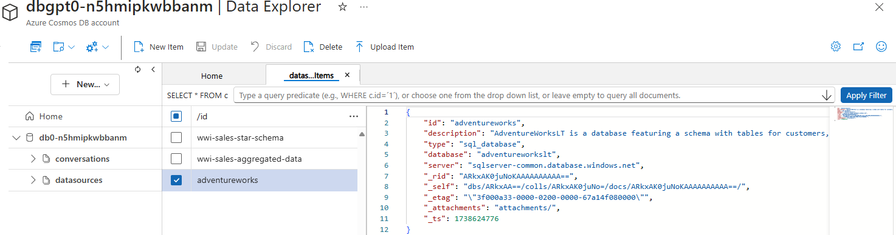

# NL2SQL and Fabric Data Ingestion

## Table of Contents

1. [**Overview**](#overview)
2. [**Data Dictionary**](#data-dictionary)
3. [**Data Sources Configuration**](#data-sources-configuration)

---

## **Overview**

**NL2SQL and Fabric Data Ingestion** involve ingesting data dictionary information into the AI Search Index, enabling the orchestrator to generate SQL and DAX queries more effectively. This process requires indexing specific metadata and optionally indexing sample query content to assist with retrieval during query generation. The data dictionary includes three types of content:

- **table:** Descriptions of tables and their columns, serving as a data dictionary.  
- **query:** Sample queries used for few-shot learning by the orchestrator.  
- **measure:** Power BI semantic model measures with name, description, data type, and source, guiding the orchestrator's selection.

---

## **Data Dictionary**

The Data Dictionary is essential for **NL2SQL** and **Chat with Fabric** scenarios, providing metadata about queries, tables, and measures that the orchestrator uses to generate optimized SQL and DAX queries. This section explains how to document the data dictionary and outlines the indexing process.

### **How to Document the Data Dictionary**

The data dictionary includes three types of content:

- **Tables:** Descriptions of tables used by the chatbot to generate queries. In the column descriptions, provide at least the column names and their descriptions; optionally, you can include data types and example values for greater clarity
- **Queries:** Sample queries used for few-shot learning by the orchestrator. These are optional, use this only for frequently used queries that help optimize the AI agents' performance.
- **Measures:** Definitions of measures for **Semantic Model** data sources, including name, description, data type, and source information. Only include measures that are essential and beneficial for the chatbot to answer user questions clearly and accurately.

Each content type is represented as a JSON file with specific attributes and should be organized into folders:

- **`tables/`**: Store JSON files that describe tables.
- **`measures/`**: Store JSON files that define measures.
- **`queries/`**: Store JSON files that contain sample queries.

The file names are flexible and should follow a clear naming convention for easy identification:

- Table files should be named after the table (e.g., `dimension_city.json`).
- Measure files should use the measure name (e.g., `total_revenue.json`).
- Query files should have descriptive names that indicate their purpose (e.g., `top_5_expensive_products.json`).

**Note:** The `datasource` field can be any name of your choice. This name will be used to reference the datasource within GPT-RAG and must contain only alphanumeric characters and dashes.

### **Data Dictionary Elements**

Before the examples, here are the field descriptions for each element type:

#### **Tables**
- **table:** The name of the table.  
- **description:** A brief description of the table's purpose and content.  
- **datasource:** The data source where the table resides.  
- **columns:** A list of columns within the table, each with the following attributes:  
  - **name:** The name of the column.  
  - **description:** A brief description of the column's content.  
  - **type:** (Optional) The data type of the column, using the datasource's type names.
  - **examples:**  (Optional) Sample values that the column might contain.  

#### **Queries**
- **datasource:** The data source where the query is executed.  
- **question:** The natural language question that the query answers.  
- **query:** The SQL or DAX query that retrieves the desired data.  
- **reasoning:**  (Optional) An explanation of how the query works and its purpose.  

#### **Measures**
- **datasource:** The data source where the measure is defined.  
- **name:** The name of the measure.  
- **description:** A brief description of what the measure calculates.  
- **type:** "external" (from another model) or "local" (calculated within the current model).
- **source_table:** (Local only) The table associated with the local measure.  
- **data_type:** (External only) Measure's data type (e.g., CURRENCY, INTEGER, FLOAT).  
- **source_model:** (External only) The source model for external measures.  

---

### **Examples**

#### **Tables**

Example of table metadata file with example column values:

```json
{
    "table": "dimension_city",
    "description": "City dimension table containing details of locations associated with sales and customers.",
    "datasource": "wwi-sales-star-schema",
    "columns": [
        { "name": "CityKey", "description": "Primary key for city records.", "type": "int", "examples": [1, 2, 3, 4, 5] },
        { "name": "City", "description": "Name of the city.", "type": "string", "examples": ["New York", "London", "Tokyo", "Paris", "Sydney"] },
        { "name": "Population", "description": "Population of the city.", "type": "int", "examples": [8419600, 8982000, 13929286, 2148000, 5312000] }
    ]
}
```

Example of simplified table metadata file with only required attributes:

```json
{
    "table": "sales_order",
    "description": "Table containing sales order data, including order IDs, dates, and customer information.",
    "datasource": "wwi-sales-data",
    "columns": [
        { "name": "OrderID", "description": "Unique identifier for each sales order." },
        { "name": "OrderDate", "description": "Date when the sales order was placed." },
        { "name": "CustomerName", "description": "Name of the customer who placed the order." }
    ]
}
```

#### **Queries**

Example of an SQL query file:

```json
{
    "datasource": "adventureworks",
    "question": "What are the top 5 most expensive products currently available for sale?",
    "query": "SELECT TOP 5 ProductID, Name, ListPrice FROM SalesLT.Product WHERE SellEndDate IS NULL ORDER BY ListPrice DESC",
    "reasoning": "This query retrieves the top 5 products with the highest selling prices that are currently available for sale."
}
```

Example of a DAX query file:

```json
{
    "datasource": "wwi-sales-aggregated-data",
    "question": "Who are the top 5 employees with the highest total sales including tax?",
    "query": "EVALUATE TOPN(5, SUMMARIZE(aggregate_sale_by_date_employee, aggregate_sale_by_date_employee[Employee], aggregate_sale_by_date_employee[SumOfTotalIncludingTax]), aggregate_sale_by_date_employee[SumOfTotalIncludingTax], DESC)",
    "reasoning": "This DAX query identifies the top 5 employees based on the total sales amount including tax."
}
```

#### **Measures**

Example of an external measure JSON:

```json
{
    "datasource": "Ecommerce",
    "name": "Total Revenue (%)",
    "description": "Calculates the percentage of total revenue for the selected period.",
    "type": "external",
    "data_type": "CURRENCY",
    "source_model": "Executive Sales Dashboard"
}
```

Example of a local measure JSON:

```json
{
    "datasource": "SalesDatabase",
    "name": "Total Orders",
    "description": "Counts the total number of sales orders for the selected period.",
    "type": "local",
    "source_table": "sales_order"
}
```

> [!Tip]
> You can find more exampes in the [samples folder](../samples/).

---

### **Ingesting the Data Dictionary**  

Each element of the data dictionary is indexed into an AI Search Index according to its type: measure, table, or query. This process is performed by an AI Search Indexer, which runs on a scheduled basis or can be triggered manually. The indexer reads JSON files from designated folders and uses Azure OpenAI Embeddings to generate vector embeddings, which are then added to the corresponding search indexes. The diagram below illustrates the NL2SQL data ingestion pipeline:


<BR>*NL2SQL Ingestion Pipeline*

#### **Workflow Description**

1. File Detection:
   - The AI Search indexers scan their designated folders:
     - `queries-indexer` scans the `queries` folder.
     - `tables-indexer` scans the `tables` folder.
     - `measures-indexer` scans the `measures` folder.

2. Vector Embedding:
   - The indexer uses the `#Microsoft.Skills.Text.AzureOpenAIEmbeddingSkill` to generate vector embeddings with Azure OpenAI Embeddings.
     - For queries, the `question` field is vectorized.
     - For tables, the `description` field is vectorized.
     - For measures, the `description` field is vectorized.

3. Content Indexing:
   - The vectorized content is added to the respective Azure AI Search indexes:
     - Queries are indexed in `nl2sql-queries`.
     - Tables are indexed in `nl2sql-tables`.
     - Measures are indexed in `nl2sql-measures`.

> [!important]
> Ensure that files are placed in their designated folders, as the indexers only scan specific subfolders.

---

## Data Sources Configuration

Data sources contain information for connecting to data sources.

**Supported data source types include:**  
- **Semantic Model:** Executes DAX queries using the Power BI REST API.  
- **SQL Endpoint:** Connects via ODBC using a **Service Principal**.  
- **SQL Database:** Connects via ODBC using **Managed Identity**.  

Data source configuration in **GPT-RAG** is managed through JSON documents stored in the `datasources` container of **CosmosDB**.


<BR>*Sample Datasource Configuration*

### **Semantic Model Example**
```json
{
    "id": "wwi-sales-aggregated-data",    
    "description": "Aggregated sales data for insights such as sales by employee or city.",
    "type": "semantic_model",
    "organization": "myorg",
    "dataset": "your_dataset_or_semantic_model_name",
    "tenant_id": "your_sp_tenant_id",
    "client_id": "your_sp_client_id"    
}
```

### **SQL Endpoint Example**
```json
{
    "id": "wwi-sales-star-schema",
    "description": "Star schema with sales data and dimension tables.",
    "type": "sql_endpoint",
    "organization": "myorg",
    "server": "your_sql_endpoint.fabric.microsoft.com",
    "database": "your_lakehouse_name",
    "tenant_id": "your_sp_tenant_id",
    "client_id": "your_sp_client_id"
}
```

### **SQL Database Example**
```json
{
    "id": "adventureworks",
    "description": "AdventureWorksLT database with customers, orders, and products.",
    "type": "sql_database",
    "database": "adventureworkslt",
    "server": "sqlservername.database.windows.net"
}
```

For data sources that require secrets—such as those accessed via a **Service Principal** or **SQL Server** using SQL authentication—passwords are stored in **Azure Key Vault** following the naming convention `{datasource_id}-secret`.  

**Example:** If the `datasource_id` is `wwi-sales-star-schema`, the corresponding secret name in Key Vault should be `wwi-sales-star-schema-secret`.


<BR>*Sample Datasource Secrets*

> [!NOTE]
> Example configuration files are available in the [sample folder](../samples/fabric/datasources.json).
